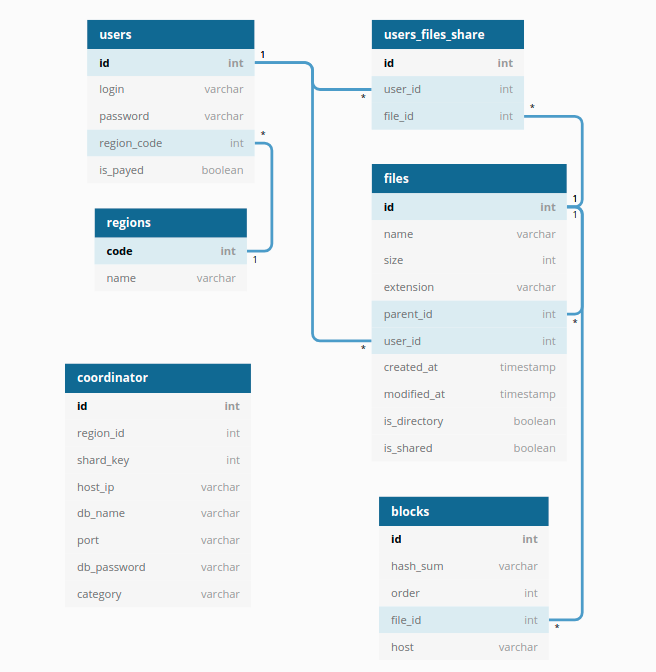
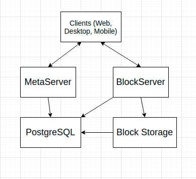
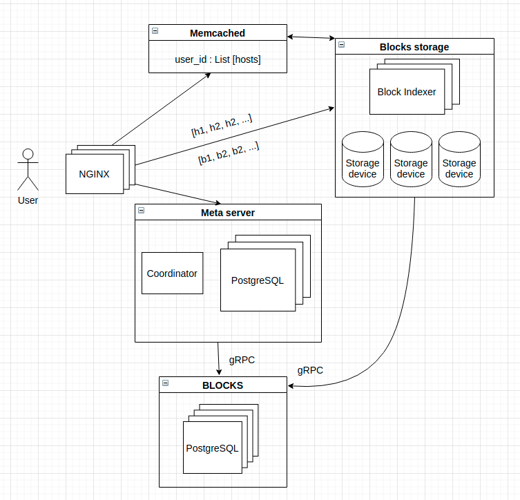

# highload_tp

Project of "highload" course in technopark

# HighloadArchitectureCourseWork

## 1. Тема и целевая аудитория

В качестве темы был выбран сервис облачного хранилища данных. 
Прототипы:

- [Dropbox](https://www.dropbox.com/) 
- [Yandex.Disk](https://disk.yandex.ru/)
- [Google Drive](https://drive.google.com/)

Проектируемый функционал MVP:

* загрузить файл
* удалить файл
* скачать файл
* посмотреть информацию о файле
* поделиться ссылкой на файл

Положим размер аудитории сервиса 10М, расположение аудитории - Россия.

[Сводная табличка по аналогичным сервисам](https://en.wikipedia.org/wiki/Comparison_of_file_hosting_services)

## 2. Расчет нагрузки

Сервис будет предоставлять **2гб** дискового пространства для бесплатного аккаунта, **1000гб** для платного.
Ограничим объем загружаемых и скачиваемых данных для пользователя за день размером в **20гб/день** для бесплатного аккаунта, **200гб/день** для платного.
Также положим, что **99%** пользователей сервиса имеют бесплатный аккаунт, а **1%** будут иметь платную подписку, т.е. платный аккаунт.
Исходя из этого, получем следующие данные:

| account type | storage | percentage | bandwidth limit | total storage size               |
| ------------ | ------- | ---------- | --------------- | -------------------------------- |
| free         | 2GB     | 99%        | 4GB/day         | 2GB * 0.99 * 10 * 10^6 =  19.8PB |
| paid         | 1000GB  | 1%         | 200GB/day       | 1000GB * 0.01 * 10 * 10^6 = 10PB |

Для расчета нагрузки будем рассматривать один из самых популярных случаев использования файловых хостингов - загрузку фотографий/документов небольшого размера и синхронизацию файлов по устройствам пользователя.

Примем ряд некоторых допущений:

* Примем средний размер хранимых файлов **4МБ** 

* Примем входящий и исходящий траффик одинаковым по объему (в первоначальном приближении)

* Бесплатные пользователи почти полностью утилизируют объём доступного им хранилища (**2ГБ**)

* Пиковый трафик будет примерно в **3** раза больше, чем средний по рассчету

  [similarweb](https://www.similarweb.com/website/disk.yandex.ru/)

| Параметр                                                     | Значение |
| :----------------------------------------------------------- | -------- |
| Аудитория                                                    | 10М      |
| Количество пользователей в сутки                             | 100 000  |
| Количество загружаемых/скачиваемых пользователем файлов в день | 200      |
| Средний размер одного файла                                  | 4 МБ     |

### Сетевой трафик:

Поправочный коэф. - 2

10e5 * 200 * 4МБ * 2 = 80 000 ГБ/день = **14800 Мбит/сек**

В период пиковой нагрузки **~45000 Мбит/сек**

### Объем хранилища:

Суммарных объем хранилища  19.8PB + 10PB = **29.8PB**.

## 3. Логическая схема БД

Упрощенный схема

## 4. Физическая схема

Вся метаинформация о пользователях, файлах и блоках будет храниться на серверах баз данных **PostgreSQL**, как хорошо себя зарекоммендовавшей в продакшн-решениях и с огромным инструментарием.

Весь контент пользователей находится в блочном хранилище на физических серверах, уникальным индентификатором блока является sha256 от его содержимого. Блоки образуют бакеты размером 1GB, бакеты организуются в RAID массивы. Хеш-суммы блоков хранятся также на клиенте.

Для осуществления быстрого поиска блока по хеш-суммам, будем использовать in-memory БД **Redis** (Block indexer) 

Активные сессии пользователей будут находится на серверах **Memcache** вместе с информацией, релевантной для сессии - ссылки на публичные файлы и списком хостов блочных хранилищ, на которых хранятся блоки недавно используемых пользователем файлов (что оптимизирует синхронизации всех устройств пользователя). 

Глобальная таблица Coordinator будет хранить в себе конфиги о всех хостах и их категории (мастер/слейв). 

#### Потребное количество памяти

Учитывая, что размер хранилища у нас 29.8ПБ, то количество файлов будет около 29.8 * 10^9 МБ / 4 МБ = **7.45 * 10^9.**

**Метасервера:**

В секунду грузится порядка 500 файлов.

Users: (8 + 64 + 64 + 8 + 1) * 10 * 10^6 = 145 Б * 10 * 10^6 =  1470 МБ

Files: (8+64+8+8+8+8+8+8+1+1) * 7.45 * 10^9 = 122 Б * 7.45 * 10^9 = 900 ГБ

Blocks: (8+64+8+8+32)  * 7.45 * 10^9 =  120 Б * 7.45 * 10^9 = 894 ГБ

Суммарно, для хранения метаинформации потребуется около **~2 ТБ** дискового пространства.

**Блоксервера:**

Количество записей (бакетов) по 1ГБ будет ~ 30 * 10^6

Key - sha256 (32Б), 

Value - bucket, checksum (8+32=40Б) 

Суммарный вес записей 72 * 30 * 10^6 = **~2.2 ГБ**

**Блочное хранилище:**  

19.8PB + 10PB = **29.8 ПB**.

#### Шардирование и репликация

Шардирование данных в PostgreSQL осуществляется для таблиц users и files - по полю user_id.

Самыми интенсивно нагруженными будут таблицы blocks, их будем шардировать по file_id партиционировать таблицы на равное количество частей на каждом сервере, тем самым облегчив вес каждой таблицы и индексов, обеспечивая выдерживание большой нагрузки как на чтение, так и на запись.

Репликацию осуществим по стандартной схеме: для каждого master'a (используется для записи) в Redis и PostgreSQL имеются два slave'a (используются для чтения).

## 5. Оборудование

**Nginx**

Машина с 16 CPU позволяет обрабатывать около 6'600 CPS через HTTPS (

[источник]: TestingthePerformanceofNGINXandNGINXPlusWebServers-NGINX(https://www.nginx.com/blog/testing-the-performance-of-nginx-and-nginx-plus-web-servers/)

). Пропускная способность составлет 48 Гбит/сек. Кол-во соединений возьмем как половину среднесуточного количества пользователей: 50000, и примем в среднем 2 устройства на одного пользователя.

Для обработки такого количества, понадобится: 50000  * 2 / 6600 = 16 серверов

Сделаем резервирование каждого сервера для обеспечения отказоустойчивости в случае выхода из строя основного.

Для организации **хранения метаданных** возьмем 6 SSD по 2ТБ в 

[RAID10]: http://www.raid-calculator.com/default.aspx

 и это даст двухкратное ускорение записи и четырёхкратное ускорение чтения, итоговый размер будет 6ТБ. Также для надёжности будем использовать ещё 2 slave реплики.

**Блоксервера:**

Для организации хранения **серверов Block Indexer'а**  будем использовать key-value in-memory БД Redis. Количество серверов будет 3, по одному на 15 стоек.  На каждом сервере хватит  8ГБ-16ГБ RAM.

Для организации **блочного хранилища** возьмем диски 

[WD]: https://www.westerndigital.com/products/data-center-platforms/ultrastar-dc-hc600-series-hdd	"WD по 20ТБ и стенд от WD c 68 дисками"

(

[ссылка]: https://www.westerndigital.com/products/data-center-platforms/ultrastar-serv60-8-hybrid-server

) (следовательно в сервер помещаетя 1360ТБ), большим объемом ОЗУ и двумя мощными процессорами Intel XEON. Данные будем хранить с использованием 

[RAID10]: http://www.raid-calculator.com/default.aspx

, соответственно каждый такой стенд даёт 680ТБ дискового пространства, а использование RAID10 с таким объемом даёт увеличение скорости чтения в 68 раз, а записи в 34 раза по сравнению с одинарным диском.

Для покрытия 29.8 ПБ данных пользователей требуется 29.8 ПБ  / 0.68ПБ = 44 стенда + 2 реплики, итого 132 стенда.

Для хранения сессий, общих ссылок и хостов в **Memcache** нам  по аналогии хватит небольшого сервера с 8ГБ-16ГБ RAM.

| Server        | CPU                 | RAM               | Disk Type | RAID Type | Disks count | Storage Size with RAID | Amount | Replicas count | Total Amount |
| ------------- | ------------------- | ----------------- | --------- | --------- | ----------- | ---------------------- | ------ | -------------- | ------------ |
| nginx         | 32                  | 64GB              | 256GB SDD | -         | 1           | -                      | 16     | 1              | 16           |
| Memcache      | 8                   | 16GB              | 1TB SDD   | -         | 1           | -                      | 1      | 2              | 3            |
| Metaserver    | 24                  | 32GB              | 2TB SSD   | RAID10    | 6           | 6TB                    | 1      | 2              | 3            |
| Blockstorage  | 24 + 24 (dual core) | 32GB * 16 = 512GB | 20TB HDD  | RAID10    | 68          | 680TB                  | 44     | 2              | 132          |
| Block Indexer | 32                  | 16GB              | 256GB SDD | -         | 1           | -                      | 3      | 2              | 9            |

## 6. Расположение серверов

Расположим сервера географически в двух регионах, для обеспечения максимального покрытия и наименьших задержек. 70 % серверов будут находится в датацентрах Москвы, оставшиеся 30% в датацентре в Новосибирске.  Для обеспечения отказоустойчивости предпочтительно размещение ресурсов у различных провайдеров.

## 7. Обеспечение отказоустойчивости

- Репликация данных пользователей (чанков) в разные ДЦ в разные зоны доступности

- Репликация in memory базы данных [Redis](https://redis.io/) с сессиями пользователей и общими ссылками
- Надежность хранения данных достигается проверкой  контрольных сумм каждого блока, а так же быстрым развертыванием бэкапов в виду простой схемы хранения. 
